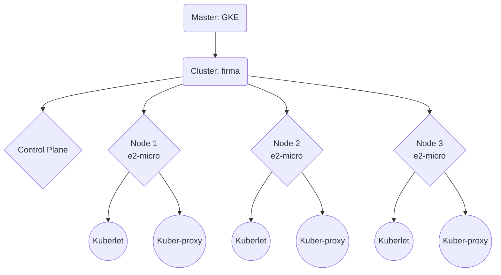

# Firma Backen

## Documentation
* [Dokcerización](./documentation/Dockerization.md)
* [Cola de mensajes](./documentation/Message%20Queue.md)
* [Lazanmiento de aplicación dokerizada multi-contenedor](./documentation/Dockerization.md)
* [Conexión al servidor en la nube Google Cloud Project](./documentation/Google%20Cloud%20Project.md)
* [Git y submodulos](./documentation/Git.md)
* [Bases de datos del sistema](./documentation/Data%20bases.md)
* [Contraseñas e instrucciones privadas](https://docs.google.com/document/d/10Nf_l2qOOvkGHcLOETpoG9xqQQvLBu-_H1nXMFO89bo/edit#heading=h.jqbg0shf0w3p)
* [Clusters](./documentation/Clusters.md)

## Micro-servicios
| service               | Repo                  | Done      | LISTEN  | 
| --------------------- | --------------------- | --------  | ------- |
| Keys MS               | firma_keys_ms         | 090%      | MQ      |
| Signing MS            | firma_signing_ms      | 080%      | 8092    |
| Verification MS       | firma_verification_ms | 000%      | 8093    |
| Users MS              | firma_user_ms         | 000%      | 8090    |
| Docs MS               | firma_docs_ms         | 000%      | 8091    |
| Storage MS            | firma_storage_ms      | 000%      | MQ      |
| API Gateway           | firma_ag              | 000%      | 8080    |
| Message Qeue (MQ)     | firma_mq              | 100%      | 5672    |
| Message Qeue UI       | firma_mq              | 100%      | 15672   |
| Proxy inverso         | firma_proxy           | 000%      | 80      |
| LDAP                  | firma_ldap            | 000%      | ¿?      |
| SOAP Interface        | firma_intercae        | 000%      | ¿?      |


## Google Cloud Project
```bash
gcloud config set project 'unal-swarch-2022i-1a'
gcloud config set compute/zone 'us-east1-b'
gcloud config list
```
salida
```bash
[compute]
region = us-east1
zone = us-east1-b
[core]
account = faroseroc@unal.edu.co
disable_usage_reporting = False
project = unal-swarch-2022i-1a

Your active configuration is: [default]
```
Variabls shell
```bash
ACCOUNT=faroseroc@unal.edu.co
PROJECT_ID=unal-swarch-2022i-1a
ZONE=us-east1-b
```

## Deployment con Docker Engine
Válido solo para la entrega #4.
### Conexión 
Leer primero [Conexión al servidor en la nube Google Cloud Project](./documentation/Google%20Cloud%20Project.md).

Iniciamos la VM
```bash
gcloud compute instances start "firma-backend"
```
Nos conectamos a la shell
```bash
gcloud compute ssh "firma-backend"
```
En la VM vamos a `cd /home/developer/firma_backend` y probamos los servicios en backend con 
```bash
./tests/checkports.sh
```
### Pull changes
```bash
cd /home/developer/firma_backend
git pull
git submodule update --init --recursive
```
### Base de datos
Credenciales: https://docs.google.com/document/d/10Nf_l2qOOvkGHcLOETpoG9xqQQvLBu-_H1nXMFO89bo/edit#heading=h.jqbg0shf0w3p
#### Importar firma_user_db:PostgreSQL
```bash
sudo -u postgres psql -f firma_user_ms/firma_user_db/firma_user_db.structure.sql
sudo -u postgres psql -d firma_user_db -f firma_user_ms/firma_user_db/firma_user_db.user.data.sql
```
#### Importar firma_keys_db:MySQL
```bash
sudo mysql -u root -p < firma_keys_ms/firma_keys_db/firma_keys_db.structure.sql
sudo mysql -u root -p < firma_keys_ms/firma_keys_db/firma_keys_db.data.sql
```

### Docker images
Se asume que todos los archivos `Dockerfile` dentro de los submódulos compilan imágenes para producción con el nombre `firma_X` y la etiqueta `latest`.
* firma_ag
* firma_docs_ms
* firma_interface
* firma_keys_ms
* firma_ldap
* firma_mq
* firma_proxy
* firma_signing_ms
* firma_storage_ms
* firma_user_ms
#### Compilación
El comando `docker build` crea imágenes de contenedores a partir de un `Dockerfile`
```bash
cd firma_backend
docker build -t firma_ag:latest             ./firma_ag/
docker build -t firma_docs_ms:latest        ./firma_docs_ms/
docker build -t firma_interface:latest      ./firma_interface/
docker build -t firma_keys_ms:latest        ./firma_keys_ms/
docker build -t firma_ag:latest             ./firma_ag/
docker build -t firma_docs_ms:latest        ./firma_docs_ms/
docker build -t firma_interface:latest      ./firma_interface/
docker build -t firma_keys_ms:latest        ./firma_keys_ms/
docker build -t firma_ldap:latest           ./firma_ldap/
docker build -t firma_mq:latest             ./firma_mq/
docker build -t firma_proxy:latest          ./firma_proxy/
docker build -t firma_signing_ms:latest     ./firma_signing_ms/
docker build -t firma_storage_ms:latest     ./firma_storage_ms/
docker build -t firma_user_ms:latest        ./firma_user_ms/
docker image ls | egrep '^firma_'
```
#### Pusheo a Github Package
**Etiquetado**
El comando `docker tag` crea nombre:etiquetas de imágenes a partir de nombre:etiquetas imágenes existentes.
```bash
cd firma_backend
docker tag firma_ag:latest         ghcr.io/unal-swarch-2022i-1a/firma_ag:latest
docker tag firma_docs_ms:latest    ghcr.io/unal-swarch-2022i-1a/firma_docs_ms:latest
docker tag firma_interface:latest  ghcr.io/unal-swarch-2022i-1a/firma_interface:latest
docker tag firma_keys_ms:latest    ghcr.io/unal-swarch-2022i-1a/firma_keys_ms:latest
docker tag firma_ldap:latest       ghcr.io/unal-swarch-2022i-1a/firma_ldap:latest
docker tag firma_mq:latest         ghcr.io/unal-swarch-2022i-1a/firma_mq:latest
docker tag firma_proxy:latest      ghcr.io/unal-swarch-2022i-1a/firma_proxy:latest
docker tag firma_signing_ms:latest ghcr.io/unal-swarch-2022i-1a/firma_signing_ms:latest
docker tag firma_storage_ms:latest ghcr.io/unal-swarch-2022i-1a/firma_storage_ms:latest
docker tag firma_user_ms:latest    ghcr.io/unal-swarch-2022i-1a/firma_user_ms:latest
docker image ls | grep unal-swarch-2022i-1a
```
**Autenticación**
Se debe generar un token en Github
```bash
export CR_PAT=YOUR_TOKEN
export USERNAME=YOUR_USERNAME
echo $CR_PAT | docker login ghcr.io -u $USERNAME --password-stdin
```
Publicación
```bash
docker push ghcr.io/unal-swarch-2022i-1a/firma_ag
docker push ghcr.io/unal-swarch-2022i-1a/firma_docs_ms
docker push ghcr.io/unal-swarch-2022i-1a/firma_interface
docker push ghcr.io/unal-swarch-2022i-1a/firma_keys_ms
docker push ghcr.io/unal-swarch-2022i-1a/firma_ldap
docker push ghcr.io/unal-swarch-2022i-1a/firma_mq
docker push ghcr.io/unal-swarch-2022i-1a/firma_proxy
docker push ghcr.io/unal-swarch-2022i-1a/firma_signing_ms
docker push ghcr.io/unal-swarch-2022i-1a/firma_storage_ms
docker push ghcr.io/unal-swarch-2022i-1a/firma_user_ms
```
Descarga
```bash
docker pull ghcr.io/unal-swarch-2022i-1a/firma_ag
docker pull ghcr.io/unal-swarch-2022i-1a/firma_docs_ms
docker pull ghcr.io/unal-swarch-2022i-1a/firma_interface
docker pull ghcr.io/unal-swarch-2022i-1a/firma_keys_ms
docker pull ghcr.io/unal-swarch-2022i-1a/firma_ldap
docker pull ghcr.io/unal-swarch-2022i-1a/firma_mq
docker pull ghcr.io/unal-swarch-2022i-1a/firma_proxy
docker pull ghcr.io/unal-swarch-2022i-1a/firma_signing_ms
docker pull ghcr.io/unal-swarch-2022i-1a/firma_storage_ms
docker pull ghcr.io/unal-swarch-2022i-1a/firma_user_ms
```

## Cluster de Kubernetes
### Google Cloud
```bash
gcloud container clusters create \
  --machine-type e2-micro \
  --num-nodes 3 \
  --zone $ZONE \
  --cluster-version latest \
  firma
```
### Local
https://minikube.sigs.k8s.io/docs/start/
```bash
minikube start
```

### Incrementar nodos (VMs)
https://cloud.google.com/kubernetes-engine/docs/how-to/resizing-a-cluster
```bash
gcloud container clusters resize $CLUSTER_NAME --node-pool $POOL_NAME \
    --num-nodes $NUM_NODES
```
### IPS externas de nodos
```bash
kubectl get node -o=custom-columns='NAME:.metadata.name,IP:.status.addresses[?(@.type=="ExternalIP")].address'
```
Salida
```bash
NAME                                   IP
gke-firma-default-pool-47052e38-cm1h   34.138.92.101
gke-firma-default-pool-47052e38-rgxl   34.148.113.185
gke-firma-default-pool-47052e38-rk93   35.243.157.67
```
### Objetos `Deployment` para 1 replica
```bash
kubectl create deployment user --image=ghcr.io/unal-swarch-2022i-1a/firma_user_ms:latest
```
Esto crea el objeto deployment
```bash
kubectl get deployment
```
```bash
NAME   READY   UP-TO-DATE   AVAILABLE   AGE
user   1/1     1            1           32s
```
... con un solo pod
```bash
kubectl get pod -o wide
```
```
NAME                    READY   STATUS    RESTARTS   AGE   IP          NODE                                   NOMINATED NODE   READINESS GATES
user-84f8854599-dvppp   1/1     Running   0          52s   10.56.1.4   gke-firma-default-pool-47052e38-rgxl   <none>           <none>
```
### Objetos `Service` para exposición de red
```bash
kubectl expose deployment user --type=LoadBalancer --port 8090
```
```bash
kubectl get service
```
```bash
NAME         TYPE           CLUSTER-IP    EXTERNAL-IP       PORT(S)          AGE
kubernetes   ClusterIP      10.60.0.1     <none>            443/TCP          15m
user         LoadBalancer   10.60.15.92   35.185.43.183     8090:32569/TCP   19s
```
Vamos a http://35.185.43.183:8090/users
