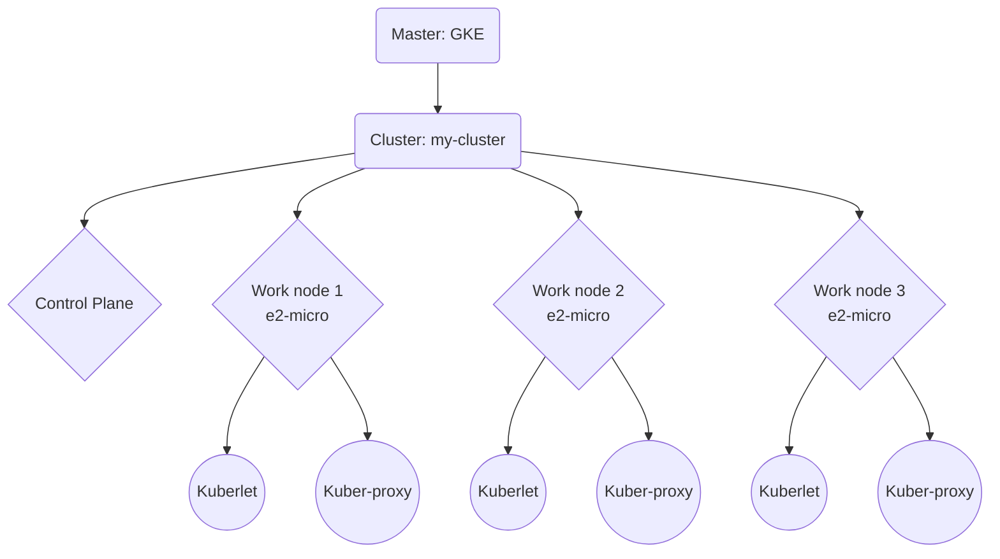

# Clusters

* [Glossary](https://kubernetes.io/docs/reference/glossary/?fundamental=true)

* [Using SSH to connect to a cluster node](https://cloud.google.com/anthos/clusters/docs/on-prem/latest/how-to/ssh-cluster-node)

* [Create basic clusters](https://cloud.google.com/anthos/clusters/docs/on-prem/latest/how-to/minimal-create-clusters)

## Conceptos clave


* **GKE:**
    > Google Kubernetes Engine (GKE) provides a managed environment for deploying, managing, and scaling your containerized applications using Google infrastructure. The GKE environment consists of multiple machines (specifically, Cohttps://kubernetes.io/docs/reference/generated/kubectl/kubectl-commands#-em-deployment-em-mpute Engine instances) grouped together to form a cluster.

    https://cloud.google.com/kubernetes-engine/docs/concepts/kubernetes-engine-overview

* **Cluster**
    > A Kubernetes cluster consists of a set of worker machines, called nodes, that run containerized applications. Every cluster has at least one **worker node**.

    > The **worker node(s)** host the **Pods** that are the components of the application workload. The **control plane** manages the worker nodes and the Pods in the cluster. In production environments, the control plane usually runs across multiple computers and a cluster usually runs multiple nodes, providing fault-tolerance and high availability.

    

* **Workload resources**: Los workload resources son administrados por **Controllers**. Un recurso puede ser un Pod, un Service, un Deployment o un Job, etc.

    > Workloads resources are responsible for managing and running your containers on the cluster. Containers are created by **Controllers** through Pods. Pods run Containers and provide environmental dependencies such as shared or persistent storage Volumes and Configuration or Secret data injected into the container.

    * **Deployment:** Permiten especificar y mantener trabajando replicas (**Pods**).
        > A Deployment provides declarative updates for **Pods** and **ReplicaSets**.

        > Deployment is a good fit for managing a stateless application workload on your cluster, where any Pod in the Deployment is interchangeable and can be replaced if needed.

        > A **ReplicaSet**'s purpose is to maintain a stable set of replica **Pods** running at any given time. As such, it is often used to guarantee the availability of a specified number of identical **Pods**

    * **StatefulSet:** 
        > lets you run one or more related Pods that do track state somehow. For example, if your workload records data persistently, you can run a StatefulSet that matches each Pod with a **PersistentVolume**. Your code, running in the Pods for that StatefulSet, can replicate data to other Pods in the same StatefulSet to improve overall resilience.

    * **DaemonSet:** 
        > defines Pods that provide node-local facilities. These might be fundamental to the operation of your cluster, such as a networking helper tool, or be part of an add-on.
        > Every time you add a node to your cluster that matches the specification in a DaemonSet, the control plane schedules a Pod for that DaemonSet onto the new node.
    * **Job** 
        > and CronJob define tasks that run to completion and then stop. Jobs represent one-off tasks, whereas CronJobs recur according to a schedule.

    * **Service**: Le da a los Pods una IP estable.
        > a Service is an abstraction which defines a logical set of Pods and a policy by which to access them (sometimes this pattern is called a micro-service)

    > These resources configure **controllers** that make sure the right number of the right kind of pod are running, to match the state you specified.

* **Controller**: Los controllers administrar **Workload resources**.
    > In Kubernetes, controllers are control loops that watch the state of your cluster, then make or request changes where needed. Each controller tries to move the current cluster state closer to the desired state.Controllers watch the shared state of your cluster through the apiserver (part of the Control Plane).
    
    > Some controllers also run inside the **control plane**, providing control loops that are core to Kubernetes' operations. For example: the deployment controller, the daemonset controller, the namespace controller, and the persistent volume controller (and others) all run within the **kube-controller-manager**.

    > The most common Controllers are:

    > * Deployments for stateless persistent apps (e.g. HTTP servers).
    > * StatefulSets for stateful persistent apps (e.g. databases).
    > * Jobs for run-to-completion apps (e.g. batch Jobs).

    https://kubernetes.io/docs/reference/glossary/?all=true#term-controller

* **Control plane**:
    > The container orchestration layer that exposes the API and interfaces to define, deploy, and manage the lifecycle of containers.[-]
    
    https://kubernetes.io/docs/reference/glossary/?all=true#term-control-plane

    > This layer is composed by many different components, such as (but not restricted to):
    > * **etcd:** etcd is a consistent and highly-available key value store used as Kubernetes' backing store for all cluster data.
    > * **API Server:** *kube-apiserver*, The API server is a component of the Kubernetes control plane that exposes the Kubernetes API. The API server is the front end for the Kubernetes control plane.
    > * **Scheduler:** *kube-scheduler* is a control plane process which assigns Pods to Nodes. It determines which Nodes are valid placements for each Pod in the scheduling queue according to constraints and available resources.
    > * **Controller Manager:** *kube-controller-manager* is a daemon that embeds the core control loops shipped with Kubernetes. It is a control loop that watches the shared state of the cluster through the apiserver and makes changes attempting to move the current state towards the desired state. 
    > * **Cloud Controller Manager:** *cloud-controller-manager* lets you link your cluster into your cloud provider's API, and separates out the components that interact with that cloud platform from components that only interact with your cluster.

* **Deployment**
    > Es un *Workload resource* administrable por un *Deployment controller*.

    > A Deployment provides declarative updates for **Pods** and **ReplicaSets**.

    > You describe a desired state in a Deployment, and the Deployment Controller changes the actual state to the desired state at> a controlled rate. You can define Deployments to create new ReplicaSets, or to remove existing Deployments and adopt all their resources with new Deployments.


* **Node**:

   

    > A node is the smallest unit of compute hardware in a Kubernetes cluster.

    > A node is a worker machine in Kubernetes and may be a VM or physical machine, depending on the cluster. Multiple Pods can run on one Node.

    > The components on a node include the **kubelet**, a **container runtime**, and the **kube-proxy**.
    
    https://kubernetes.io/docs/concepts/architecture/nodes/

    * **Kubelet**:
        > An agent that runs on each node in the cluster. It makes sure that containers are running in a Pod.
        https://kubernetes.io/docs/concepts/overview/components/#kubelet

    * **Container runtime**:
        > The container runtime is the software that is responsible for running containers.

        > Kubernetes supports container runtimes such as (**Docker Engine**,) containerd, CRI-O, and any other implementation of the Kubernetes CRI (Container Runtime Interface).
        https://kubernetes.io/docs/concepts/overview/components/#kubelet

    * **Kube-proxy**:
        > kube-proxy is a network proxy that runs on each node in your cluster, implementing part of the Kubernetes **Service** concept.
        > kube-proxy maintains network rules on nodes. These network rules allow network communication to your Pods from network sessions inside or outside of your cluster.   
        https://kubernetes.io/docs/concepts/overview/components/#kube-proxy

* **Node pools (GKE):**
    > A node pool is a group of nodes within a cluster that all have the same configuration. Node pools use a NodeConfig specification. Each node in the pool has a Kubernetes node label, cloud.google.com/gke-nodepool, which has the node pool's name as its value.

    https://cloud.google.com/kubernetes-engine/docs/concepts/node-pools

* **Pod**: 

    

    > A pod is the smallest execution unit in Kubernetes.

    > A Pod is a group of one or more application containers (such as Docker) and includes shared storage (volumes), IP address and information about how to run them. Pods utilize an agent on each node called a **kubelet** to communicate with the Kubernetes API and the rest of the cluster. 

    * **Volume**:
        > A Pod can use any number of volume types simultaneously. Ephemeral volume types have a lifetime of a pod, but persistent volumes exist beyond the lifetime of a pod. When a pod ceases to exist, Kubernetes destroys ephemeral volumes; however, Kubernetes does not destroy persistent volumes. For any kind of volume in a given pod, data is preserved across container restarts.
        https://kubernetes.io/docs/concepts/storage/volumes/

    * **Containerized applications**:
        > Containerized applications are applications that run in isolated runtime environments called containers. Containers encapsulate an application with all its dependencies, including system libraries, binaries, and configuration files.

* **Namespaces**:
    > It provides a mechanism for isolating groups of resources within a single cluster. Names of resources need to be unique within a namespace, but not across namespaces. Namespace-based scoping is applicable only for namespaced objects (e.g. Deployments, Services, etc) and not for cluster-wide objects (e.g. StorageClass, Nodes, PersistentVolumes, etc).

## FAQ

### ReplicaSet vs Deployment
> A ReplicaSet ensures that a number of Pods is created in a cluster. The pods are called replicas and are the mechanism of availability in Kubernetes. But changing the ReplicaSet will not take effect on existing Pods, so it is not possible easily change, for example, the image version.

> A deployment is a higher abstraction that manages one or more ReplicaSets to provide controlled rollout of a new version. When the image version is changed in the Deployment, a new ReplicaSet for this version will be created with initially zero replicas. Then it will be scaled to one replica, after that is running, the old ReplicaSet will be scaled down. (The number of newly created pods, the step size so to speak, can be tuned.)

https://stackoverflow.com/a/69448162

## Setup local
Para instalar `kubectl` y `ke-gcloud-auth-plugin` en local:
```bash
gcloud components install kubectl
gcloud components install gke-gcloud-auth-plugin
```
Verificar instalaciones
```bash
kubectl version
gke-gcloud-auth-plugin --version
```

## Login GCloud
```bash
gcloud config set project 'unal-swarch-2022i-1a'
gcloud config set compute/zone 'us-east1-b'
gcloud config list
```
salida
```bash
[compute]
region = us-east1
zone = us-east1-b
[core]
account = faroseroc@unal.edu.co
disable_usage_reporting = False
project = unal-swarch-2022i-1a

Your active configuration is: [default]
```
Variabls shell
```bash
ACCOUNT=faroseroc@unal.edu.co
PROJECT_ID=unal-swarch-2022i-1a
ZONE=us-east1-b
```
## Listar clusters en GCLoud
```bash
gcloud container clusters list
```
## `kubectl`
Kubectl permite administrar los cluster kubernets de Google Cloud. Para un entorno local, Kubectl no instala el motor de kubernets, es necesario instalar uno como **Minikube**.

## Crear clusters en GCLoud
```bash
gcloud container clusters create my-cluster
```

Mas avanzado sería:
```bash
gcloud container clusters create 
  --machine-type ec2-micro \
  --num-nodes 3 \
  --zone $ZONE \
  --cluster-version latest \
  my-cluster
```

Puede ver todos la info del nodo con `kubectl get node -o yaml` o  ``kubectl get node -o wide`  pero también se pueden seleccionar las columnas
```bash
kubectl get node -o=custom-columns='NAME:.metadata.name,IP:.status.addresses[?(@.type=="ExternalIP")].address'
```
Salida
```bash
NAME                                    IP
gke-my-cluster-default-pool-7f64faad-6zsb   35.243.135.221
gke-my-cluster-default-pool-7f64faad-jtms   34.139.16.207
gke-my-cluster-default-pool-7f64faad-v4d2   34.139.217.139
```

### Credenciales con `kubeconfig` para kubectl
Son archivos para contexto que kubectl usa para definir la información de los clusters, usuarios, namespaces y autenticación. Por defecto, kubectl busca por el archivo en `$HOME/.kube` pero se puede especificar con la bandera `--kubeconfig`.

Para generar un kubeconfig de un cluster en nuestro contexto (`$HOME/.kube/config`) correr `get-credentials` [[?](https://cloud.google.com/sdk/gcloud/reference/container/clusters/get-credentials)]
```bash
gcloud container clusters get-credentials $CLUSTER_NAME
```
salida
```bash
Fetching cluster endpoint and auth data.
kubeconfig entry generated for my-cluster.
```

Para ver todas las configuraciones y contextos:
```bash
kubectl config view
kubectl config get-contexts
```

Para ver la configuración actual
```bash
kubectl config current-context
```
### Agregar un nodo al cluster
```bash
gcloud container clusters resize firma --node-pool default-pool --num-nodes 4
```

#### Parar VM (nodos) del cluster
```bash
gcloud container clusters resize firma --node-pool default-pool --num-nodes 0
```

### Crear pods con `Deployment`
Uno en teoria puede crear pods con `kubectl run` pero es con un recurso `deployment` que se pueden administrar `replicas`
```bash
kubectl create deployment hello-server  --image=gcr.io/google-samples/hello-app:1.0
```
```bash
kubectl get deployment
```
```bash
kubectl get pods
```

### Exponer un puerto con `Service`
A pesar de que cada Pod tiene una IP única, estas nos son expuestas fuera del cluster sin un *Service*. *Services* puede ser expuestos en diferentes maneras:
* `ClusterIP`(default): Hace el servicio accesible solo dentro del cluster.
* `NodePort`: Expone el servicio en el mismo puerto de cada nodo usando NAT (Network Address Traslation). Superconjunto de `ClusterIP`.
* `LoadBalancer`: Crear un *load balancer* en el servicio de nube (p.ej. Google Cloud) y le asigna un IP fija. Superconjunto de `NodePort`.
* `ExternalName`: Mapea un servicio a los contenidos del campo `externalName` retornando un registro CNAME con ese valor.

```bash
kubectl expose deployment hello-server  --type=LoadBalancer --port 8080
```

```bash
kubectl get deployment
```
